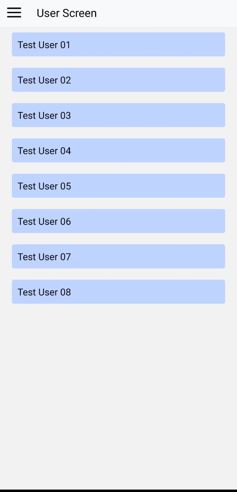

# mobile_task_harsh

## Installation of App to run server locally

- <code>cd WhiteLabelApp</code> - to go inside folder
- <code>npm install</code> - to install packages
- <code>npm start</code> - to start server

---

## Screenshots

### 1. Home Screen

### 2. Wallet Screen

### 3. Profile Screen

### 4. Users Screen

### 5. User Details Screen

---

## Demo

<video width="600" controls>
  <source src="./Assets/video1336060761.mp4">
  Your browser does not support the video tag.
</video>
